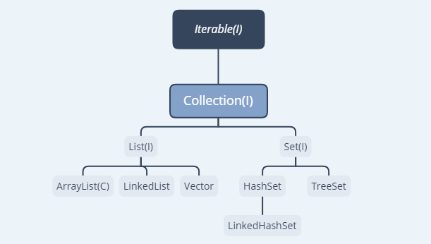

---
title:集合基础
---

# 集合概述

## 一、集合与数组

- 集合、数组都是对多个**数据进行存储操作**的结构，简称 Java 容器（说明：此时的存储，主要指的是内存层面的存储，不涉及到持久化的存储--->.txt, .jpg, .avi, 数据库中）
- 使用 Array 存储对象方面具有一些弊端，而 Java 集合就像一种容器，可以 **动态** 地把多个对象的引用放入容器中

### 数组回顾

😊 优点

1. 数组一旦初始化之后，**长度确认**
2. 数组声明的类型，**决定元素初始化类型**，如：String[] arr , int[] arr。一但元素的类型确定了，我们就只能操作指定类型的元素数据

😢 缺点

1. 数组初始化后，长度不可变，**不便于扩展**
2. 数组中**提供的属性和方法少**，不便于进行添加、删除、插入等操作，且效率不高。
3. **无法直接获取存储元素的个数**
4. 数组存储的数据是有序的、可重复，对于无序、不可重复的需求，不能满足。----> **存储数据的特点单一**
   💡 解决方法 **`集合`** --- 用于存储数量不等的多个**对象**，还可用于保存具有**映射关系的关联数组**

## 二、集合的两大接口 Collection、Map

### （一）Collection

🔎 单列集合：存储一个对象（值）<br>


### 1. 常用方法

### add()

```js
Collection col = new ArrayList();
col.add("aa");
col.add("bb");
col.add(123);//自动装箱
col.add(new Date());
```

### remove(index)

```js
col.remove(1);
```

### contains()

```js
Collection coll = new ArrayList();
coll.add(123);
coll.add(456);
coll.add(new String("Tom"));
coll.add(false);
coll.add(new Person("Jerry",20));

// contains(Object obj)：判断当前集合中是否包含obj
//在判断时会调用obj对象所在类的equals()
boolean contains = coll.contains(123);//contains = true

System.out.println(coll.contains(new String("Tom")));
//true ,String有重写equals方法：判断内容是否一致
// System.out.println(coll.contains(p));//true

System.out.println(coll.contains(new Person("Jerry",20)));
//false 自定义的Person类中并没有重写equals方法，故false

```

### 🔍 注意 <br>

- 使用`contains()`时，会调用`obj`对象所在类的`equals()`。
- `Collection`接口的实现类对象中添加数据 obj 时，要求`obj`所在类重写`equals()`。

### size()

```js
System.out.println(col.size()); //4 获取添加元素的个数
```

### isEmpty()

```js
col.isEmpty(); //判断当前集合是否为空
```

### clear()

```js
col.clear(); //清空集合元素
```

### addAll()

```js
Collection coll = new ArrayList();
coll.add(456);
coll.add("CC");

col.addAll(coll);
```

### removeAll(Object obj)

```js
System.out.println(col.size()); //4 获取添加元素的个数
```

### （二）Map

🔎 双列集合：存储一对数据（ key-value） 数据对 类似函数 y=f(x)
